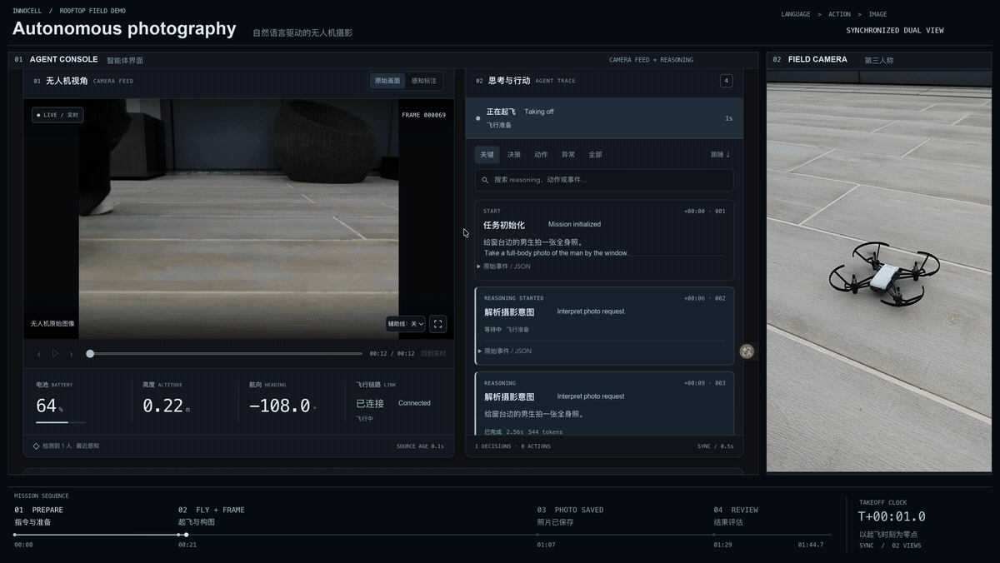
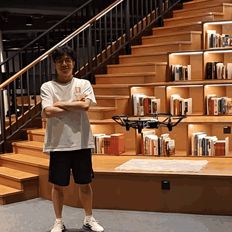
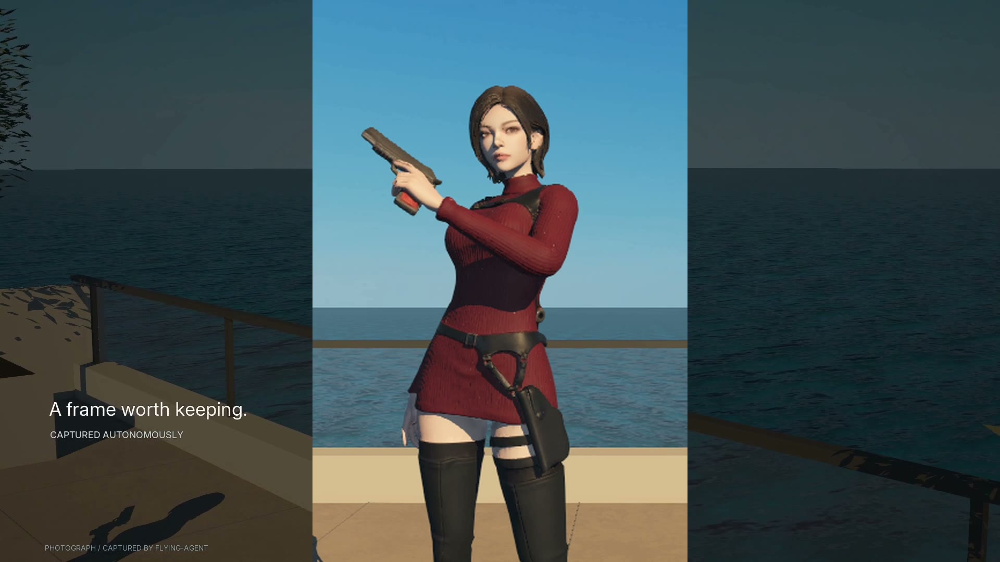
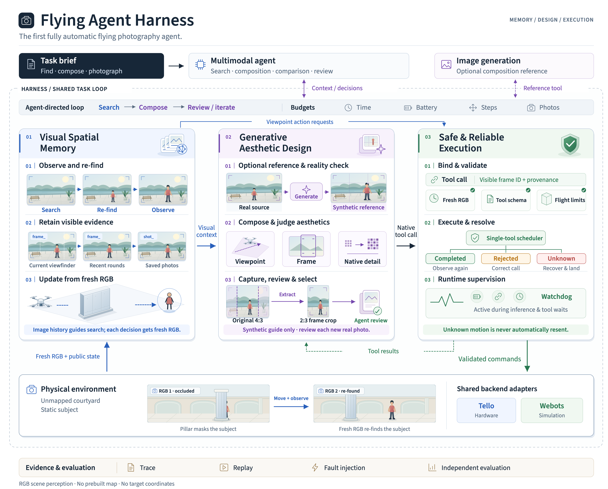

# Flying-Agent

English · [简体中文](README.zh-CN.md)

Complete frontier AI agent systems are increasingly able to carry out complex, long-horizon work in digital environments, including automated programming and research. A more fundamental question remains: **can they do the same when work takes place in ordinary people's physical lives?** Physical tasks cannot be completed by querying a complete state at every moment. An agent must find information through vision and other forms of perception, move through space, execute multiple steps continuously to completion, and take responsibility for omissions, change, failure, and safety consequences.

Unlike the still far-from-mature forms of humanoid robots and robotic arms, **we want to give AI agents a body that can move and fly in real 3D space: a drone.** We aim to explore the limits and application frontiers of agents with mobile embodiments.

Flying-Agent does not ask merely whether an AI agent can make a drone move. It asks whether **one complete agent system can use a drone as a general-purpose physical body to independently accomplish long-horizon agentic tasks with real-world outcomes**.

We use a **DJI Tello**, relying on **first-person vision (FPV) for scene perception** in unfamiliar environments and carrying out natural-language photography tasks zero-shot. Given “Take a full-body photo of the man by the window,” the agent observes the scene, adjusts its viewpoint and composition online, captures a photograph, and lands. Drone photography is only the starting point.

## Real-world flight demos

The rooftop demo shows a complete photography task on a real Tello. A library clip highlights behavior in another setting: **before moving backward into an area it has not yet seen clearly, the agent turns to look behind and checks whether there is enough room.** Observation can itself be a deliberate action.

<table>
<tr><th>Rooftop photography</th><th>Library: look before moving</th></tr>
<tr>
<td></td>
<td></td>
</tr>
</table>

[Watch rooftop demo · 4K](https://lzr-s.github.io/Flying-Agent/#rooftop) · [Watch library clip](https://lzr-s.github.io/Flying-Agent/#library)

## Webots photography demo

The [34-second coastal-terrace demo](assets/webots-photography-cinematic.mp4) is a condensed, edited view of a Webots portrait task. It shows the agent using a composition reference, adjusting its camera viewpoint, comparing the live frame with the intended composition, and capturing a final portrait. The reference image is synthetic; the final photograph comes from the simulated camera. This demo focuses on **photographic judgment through action**: subject scale, framing, headroom, and background are changed by moving the drone, then checked against the real camera view.

[Watch the Webots photography demo](assets/webots-photography-cinematic.mp4)

## Photography agent harness

Our harness connects a multimodal agent to a shared task loop, flight tools, and camera feedback. The agent can search, re-find a subject, adjust composition, capture, review, and iterate. Recent visual observations and saved photos provide evidence for the next decision; search and composition are decisions within the same loop rather than separate fixed workflows.

The harness has three cooperating parts:

- **Visual-spatial memory:** keeps the current camera view, recent observations, and saved photos available for visual decisions without handing the agent a prebuilt map or target coordinates.
- **Generative aesthetic design:** can produce an optional composition reference, then checks it against camera images. The agent adjusts viewpoint and uses the largest native crop of the requested aspect ratio when framing the shot.
- **Safe and reliable execution:** validates tool calls, runs one flight command at a time, supervises control while the agent thinks, and records completed, rejected, or uncertain actions.

The same task interface supports Webots simulation and DJI Tello hardware. Flight telemetry remains available to the controller and safety supervision; task-level scene decisions are grounded in camera images. The diagram describes the harness design; the videos above are separate demonstrations and should not be treated as identical runs.

## Coming next

We plan to release the photography harness source, reproducible Webots scenarios, more complete demo runs, and the documentation needed to inspect how a task was executed. We will keep improving the harness across perception, composition, and reliable flight.

Our longer-term research plan is to open-source trained models and the data pipeline used to build them, and to add a **Jev-based System 1** for fast local decisions alongside the deliberative multimodal agent (**System 2**). The goal is to study how the two systems can cooperate during flight. These are planned releases and research directions, not capabilities claimed for the demos above.

Beyond photography, we want to explore inspection, companionship, entertainment, and collaboration among multiple robots. We welcome discussion and collaboration.

**Code release: coming soon.** The repository currently contains the project overview and demos; the harness source and reproducibility materials will follow.
