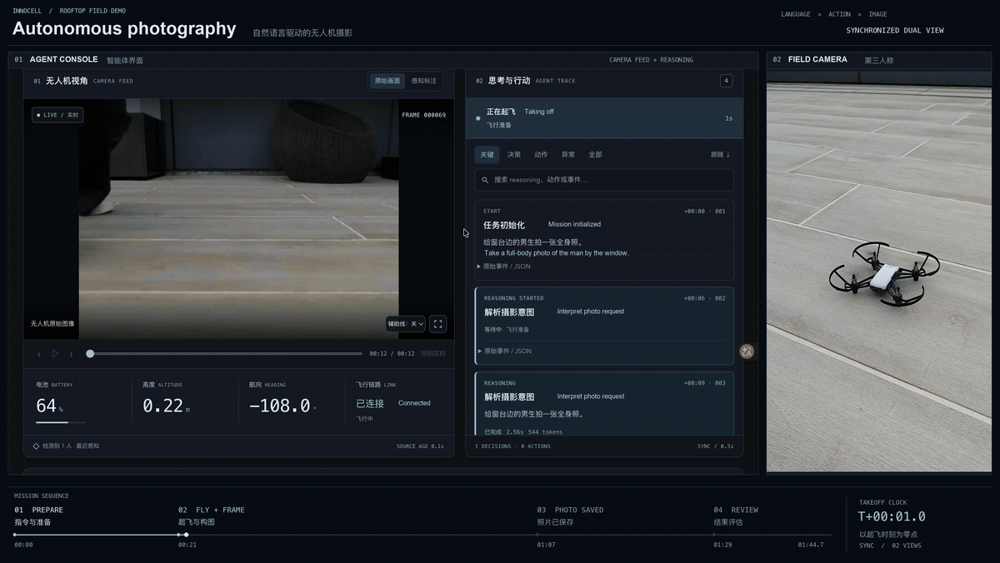
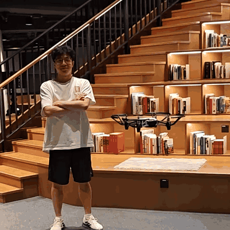

# Flying-Agent

[English](README.md) · 简体中文

完整的前沿 AI Agent 系统已经越来越能够在数字环境中完成自动化编程、研究等复杂长程工作。一个更根本的问题是：**当工作发生在普通人的物理生活中，它们还能做到吗？** 物理任务不能靠随时查询完整状态来完成；Agent 必须从视觉等感知中寻找信息，在空间中行动，把多个步骤连续执行到底，并对遗漏、变化、失败和安全后果负责。

区别于目前还远远不够成熟的人形机器人、机械臂等形态，**我们希望赋予 AI Agent 一个可以在真实三维空间中移动、飞行的本体：无人机。** 我们想要探索 Agent 在可移动本体下的能力边界与应用场景极限。

Flying-Agent 研究的不是“AI Agent 能不能让无人机动起来”，而是 **同一个完整的 Agent 系统能否把无人机作为通用的物理行动身体，独立完成有实际结果的长程 agentic 任务**。

当前使用 **DJI Tello** 无人机，仅依靠 **FPV 第一人称视觉**感知陌生环境，zero-shot 执行自然语言摄影任务。用户只需说“给窗台边的男生拍一张全身照”，智能体就会观察场景、在线调整视角与构图、拍照并降落。无人机摄影只是起点。

天台演示展示完整流程；图书馆片段则展示：**准备向尚未看清的后方移动时，它会先回头看看，确认后方是否有足够空间。** 观察也可以是一种主动行动。

<table>
<tr><th>天台摄影</th><th>图书馆：先看再移动</th></tr>
<tr>
<td></td>
<td></td>
</tr>
</table>

[播放天台完整版](https://lzr-s.github.io/Flying-Agent/#rooftop) · [播放图书馆片段](https://lzr-s.github.io/Flying-Agent/#library)

可拖动进度或全屏观看。

未来，我们将探索巡检、陪伴、娱乐和多机器协同等方向，让飞行本体在更丰富的环境中完成有价值、有意思的事，欢迎一起交流合作。

**代码 Coming soon。** 目前公开简要的项目介绍与演示，后续将持续完善和开源代码、文档和更多任务示例。
