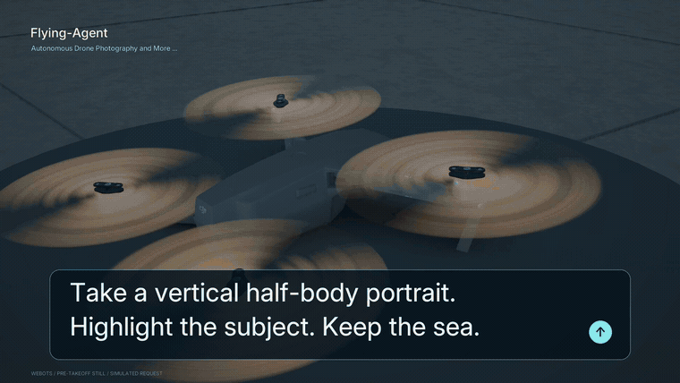

# Flying-Agent

[English](README.md) · 简体中文

完整的前沿 AI Agent 系统已经越来越能够在数字环境中完成自动化编程、研究等复杂长程工作。一个更根本的问题是：**当工作发生在普通人的物理生活中，它们还能做到吗？** 物理任务不能靠随时查询完整状态来完成；Agent 必须从视觉等感知中寻找信息，在空间中行动，把多个步骤连续执行到底，并对遗漏、变化、失败和安全后果负责。

区别于目前还远远不够成熟的人形机器人、机械臂等形态，**我们希望赋予 AI Agent 一个可以在真实三维空间中移动、飞行的本体：无人机。** 我们想要探索 Agent 在可移动本体下的能力边界与应用场景极限。

Flying-Agent 研究的不是“AI Agent 能不能让无人机动起来”，而是 **同一个完整的 Agent 系统能否把无人机作为通用的物理行动身体，独立完成有实际结果的长程 agentic 任务**。

当前使用 **DJI Tello** 无人机，依靠 **FPV 第一人称视觉进行场景感知**，在陌生环境中 zero-shot 执行自然语言摄影任务。用户只需说“给窗台边的男生拍一张全身照”，智能体就会观察场景、在线调整视角与构图、拍照并降落。无人机摄影只是起点。

## 真机飞行演示

天台演示展示了 Tello 真机上的完整摄影任务；图书馆片段则展示：**准备向尚未看清的后方移动时，Agent 会先回头看看，确认后方是否有足够空间。** 观察也可以是一种主动行动。

<table>
<tr><th>天台摄影</th><th>图书馆：先看再移动</th></tr>
<tr>
<td></td>
<td></td>
</tr>
</table>

[播放天台完整版](https://lzr-s.github.io/Flying-Agent/#rooftop) · [播放图书馆片段](https://lzr-s.github.io/Flying-Agent/#library)

## Webots 摄影演示

[34 秒海岸露台演示](https://lzr-s.github.io/Flying-Agent/#webots)剪辑呈现了一次 Webots 人像摄影任务：Agent 使用构图参考、调整相机机位、比较实时画面与预期构图，最后拍下人像。参考图是合成图，最终照片来自仿真相机。这个演示重点是**通过行动完成摄影判断**：无人机移动后，人物大小、画面边界、头顶留白和背景随之改变，Agent 再依据真实相机画面检查结果。

[观看 Webots 摄影演示](https://lzr-s.github.io/Flying-Agent/#webots)

## 摄影 Agent Harness

Harness 将多模态 Agent、统一任务循环、飞行工具和相机反馈连接起来。Agent 可以搜索与重新寻找目标、调整构图、拍摄、复核并继续优化。近期视觉观察和已保存照片为下一步决策提供证据；搜索与构图由同一循环中的决策驱动，而非两套固定流程。

Harness 由三个相互配合的部分组成：

- **视觉空间记忆：**保留当前相机画面、近期观察和已拍照片供 Agent 判断；不向它提供预建地图或目标坐标。
- **生成式美学设计：**可选生成构图参考，再与相机画面核对。Agent 通过调整机位构图，按指定比例使用传感器画面中最大的原生裁切区域。
- **安全可靠执行：**校验工具调用，逐条调度飞行命令，在 Agent 推理期间维持飞控与监督，并记录完成、拒绝和结果不确定的动作。

Webots 仿真与 DJI Tello 真机使用相同的任务接口。飞控遥测由控制器和安全监督使用；任务级场景判断以相机图像为依据。下图说明 Harness 的设计，上方视频是不同的演示，不代表同一次运行。

## 即将公开与后续计划

我们计划公开摄影 Harness 的源代码、可复现的 Webots 场景、更多完整演示，以及供外部检查任务过程的文档。Harness 也会持续围绕感知、构图和可靠飞行改进。

更长期的研究计划包括开源训练好的模型及其数据管线，并加入**基于 Jev 的 System 1**，让快速的局部决策与负责长程任务的多模态 Agent（**System 2**）协同工作。我们将研究双系统在飞行中的配合方式。这些是计划中的发布与研究方向，不代表上方演示已经具备相应能力。

摄影之外，我们还想探索巡检、陪伴、娱乐和多机器人协作，欢迎交流与合作。

**代码即将公开。** 当前仓库提供项目介绍与演示；Harness 源码及复现材料会后续加入。
